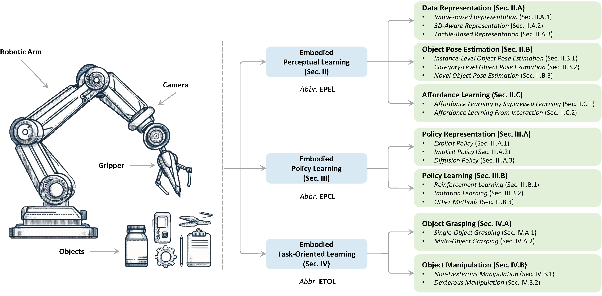

<div align="center">

# Awesome Object-Centric Robotic Manipulation 
[](https://arxiv.org/abs/2408.11537)
[](https://awesome.re) [](LICENSE) 
[](https://github.com/RayYoh/OCRM_survey/pulse) 
[](http://makeapullrequest.com)

</div>

<p align="center">
    
</p>

This is the repository of **A Survey of Embodied Learning for Object-Centric Robotic Manipulation**, a comprehensive review of latest advancements in object-centric robotic manipulation including embodied perceptual learning, embodied policy learning, and embodied task-oriented learning. For details, please refer to:
<div align="center">
  <b><a style="font-size: 18px;" href="https://arxiv.org/abs/2408.11537">A Survey of Embodied Learning for Object-Centric Robotic Manipulation</a></b>
</div>

*Any contributions to this list are most welcome! Please feel free to open issues or create pull requests as follows:*

- Fork the project into your own repository.
- Add the Title, Paper link, Venue, Code/Project link in `README.md` using the following format:
    ```
    |[Title](Paper Link)|Venue|[Code/Project](Code/Project link)|
    ```
- Submit the pull request to this branch.

## 🔥 News
Last update on 2024/08/22

## :hammer: Abstract
Embodied learning for object-centric robotic manipulation is a rapidly developing and challenging area in embodied AI. It is crucial for advancing next-generation intelligent robots and has garnered significant interest recently. Unlike data-driven machine learning methods, embodied learning focuses on robot learning through physical interaction with the environment and perceptual feedback, making it especially suitable for robotic manipulation. In this paper, we provide a comprehensive survey of the latest advancements in this field and categorize the existing work into three main branches: 1) Embodied perceptual learning, which aims to predict object pose and affordance through various data representations; 2) Embodied policy learning, which focuses on generating optimal robotic decisions using methods such as reinforcement learning and imitation learning; 3) Embodied task-oriented learning, designed to optimize the robot's performance based on the characteristics of different tasks in object grasping and manipulation. In addition, we offer an overview and discussion of public datasets, evaluation metrics, representative applications, current challenges, and potential future research directions.

## :pencil: Citation

```bib
@article{zheng2024ocrm,
  author= {Zheng, Ying and Yao, Lei and Su, Yuejiao and Zhang, Yi and Wang, Yi and Zhao, Sicheng and Zhang, Yiyi and Chau, Lap-Pui},
  title= {A Survey of Embodied Learning for Object-Centric Robotic Manipulation},
  journal={arXiv preprint arXiv:2408.11537},
  year={2024}
}
```
- [Awesome Object-Centric Robotic Manipulation](#awesome-object-centric-robotic-manipulation)
  - [🔥 News](#-news)
  - [:hammer: Abstract](#hammer-abstract)
  - [:pencil: Citation](#pencil-citation)
  - [Embodied Perceptual Learning](#embodied-perceptual-learning)
    - [Data Representation](#data-representation)
      - [Image-Based Representation](#image-based-representation)
      - [3D-Aware Representation](#3d-aware-representation)
      - [Tactile-Based Representation](#tactile-based-representation)
    - [Object Pose Estimation](#object-pose-estimation)
      - [Instance-Level Object Pose Estimation](#instance-level-object-pose-estimation)
      - [Category-Level Object Pose Estimation](#category-level-object-pose-estimation)
      - [Novel Object Pose Estimation](#novel-object-pose-estimation)
    - [Affordance Learning](#affordance-learning)
      - [Affordance Learning by Supervised Learning](#affordance-learning-by-supervised-learning)
      - [Affordance Learning From Interaction](#affordance-learning-from-interaction)
  - [Embodied Policy Learning](#embodied-policy-learning)
    - [Policy Representation](#policy-representation)
      - [Explicit Policy](#explicit-policy)
      - [Implicit Policy](#implicit-policy)
      - [Diffusion Policy](#diffusion-policy)
    - [Policy Learning](#policy-learning)
      - [Reinforcement Learning](#reinforcement-learning)
      - [Imitation Learning](#imitation-learning)
      - [Other Methods](#other-methods)
  - [Embodied Task-Oriented Learning](#embodied-task-oriented-learning)
    - [Object Grasping](#object-grasping)
      - [Single-Object Grasping](#single-object-grasping)
      - [Multi-Object Grasping](#multi-object-grasping)
    - [Object Manipulation](#object-manipulation)
      - [Non-Dexterous Manipulation](#non-dexterous-manipulation)
      - [Dexterous Manipulation](#dexterous-manipulation)
  - [Datasets](#datasets)
    - [Datasets for Object Grasping](#datasets-for-object-grasping)
    - [Datasets for Object Manipulation](#datasets-for-object-manipulation)
  - [Applications](#applications)
    - [Industrial Robots](#industrial-robots)
    - [Agricultural Robots](#agricultural-robots)
    - [Domestic Robots](#domestic-robots)
    - [Surgical Robots](#surgical-robots)
    - [Other Applications](#other-applications)
  - [Challenges and Future Directions](#challenges-and-future-directions)
    - [Sim-to-Real Generalization](#sim-to-real-generalization)
    - [Multimodal Embodied LLMs](#multimodal-embodied-llms)
    - [Human-Robot Collaboration](#human-robot-collaboration)
    - [Model Compression and Robot Acceleration](#model-compression-and-robot-acceleration)
    - [Model Interpretability and Application Safety](#model-interpretability-and-application-safety)
  - [:books: License](#books-license)

## Embodied Perceptual Learning
### Data Representation
#### Image-Based Representation
| Paper                    |  Venue | Code/Project |                                  
|---------------------------------------------|:-------------:|:------------:|
|[Real-time seamless single shot 6d object pose prediction](https://openaccess.thecvf.com/content_cvpr_2018/papers/Tekin_Real-Time_Seamless_Single_CVPR_2018_paper.pdf)|CVPR 2018|-|
|[MonoGraspNet: 6-DoF Grasping with a Single RGB Image](https://arxiv.org/pdf/2209.13036)|ICRA 2023|-|
|[RGBGrasp: Image-based Object Grasping by Capturing Multiple Views during Robot Arm Movement with Neural Radiance Fields](https://arxiv.org/pdf/2311.16592)|RAL 2024|[Project](https://sites.google.com/view/rgbgrasp)|
|[RGBManip: Monocular Image-based Robotic Manipulation through Active Object Pose Estimation](https://arxiv.org/pdf/2310.03478)|ICRA 2024|[Project](https://rgbmanip.github.io/)|
|[Evo-NeRF: Evolving NeRF for Sequential Robot Grasping of Transparent Objects](https://openreview.net/forum?id=Bxr45keYrf)|CoRL 2022|[Project](https://sites.google.com/view/evo-nerf)|
|[Clear-Splatting: Learning Residual Gaussian Splats for Transparent Object Manipulation](https://openreview.net/forum?id=HcUC6hGcwu)|ICRAW 2024|-|


#### 3D-Aware Representation
Depth-based representations
| Paper                    |  Venue | Code/Project |                                  
|---------------------------------------------|:-------------:|:------------:|
|[RGB-D object detection and semantic segmentation for autonomous manipulation in clutter](https://arxiv.org/pdf/1810.00818)|IJRR 2018|-|

Point cloud-based representations
| Paper                    |  Venue | Code/Project |                                  
|---------------------------------------------|:-------------:|:------------:|
|[Shape completion enabled robotic grasping](https://arxiv.org/pdf/1609.08546)|IROS 2017|-|
|[PointNetGPD: Detecting Grasp Configurations from Point Sets](https://arxiv.org/pdf/1809.06267)|ICRA 2019|[Project](https://lianghongzhuo.github.io/PointNetGPD/)|
|[3D Implicit Transporter for Temporally Consistent Keypoint Discovery](https://openaccess.thecvf.com/content/ICCV2023/html/Zhong_3D_Implicit_Transporter_for_Temporally_Consistent_Keypoint_Discovery_ICCV_2023_paper.html)|ICCV 2023|[Code](https://github.com/zhongcl-thu/3D-Implicit-Transporter)|

Other representations
| Paper                    |  Venue | Code/Project |                                  
|---------------------------------------------|:-------------:|:------------:|
|[RVT: Robotic View Transformer for 3D Object Manipulation](https://proceedings.mlr.press/v229/goyal23a.html)|CoRL 2023|[Project](https://robotic-view-transformer.github.io/)|
|[GNFactor: Multi-Task Real Robot Learning with Generalizable Neural Feature Fields](https://proceedings.mlr.press/v229/ze23a.html)|CoRL 2023|[Project](https://yanjieze.com/GNFactor/)|
|[ManiGaussian: Dynamic Gaussian Splatting for Multi-task Robotic Manipulation](https://arxiv.org/pdf/2403.08321)|ECCV 2024|[Project](https://guanxinglu.github.io/ManiGaussian/)|
|[Object-Aware Gaussian Splatting for Robotic Manipulation](https://openreview.net/forum?id=gdRI43hDgo)|ICRAW 2024|[Project](https://object-aware-gaussian.github.io/)|


#### Tactile-Based Representation
| Paper                    |  Venue | Code/Project |                                  
|---------------------------------------------|:-------------:|:------------:|
|[GelSight: High-Resolution Robot Tactile Sensors for Estimating Geometry and Force](https://www.mdpi.com/1424-8220/17/12/2762)|Sensors 2017|-|
|[Digit: A novel design for a low-cost compact high-resolution tactile sensor with application to in-hand manipulation](https://arxiv.org/pdf/2005.14679)|RAL 2020|[Project](https://digit.ml/)|
|[Allsight: A low-cost and high-resolution round tactile sensor with zero-shot learning capability](https://arxiv.org/pdf/2307.02928)|RAL 2023|[Code](https://github.com/osheraz/allsight)|
|[Learning to grasp without seeing](https://arxiv.org/pdf/1805.04201)|ISER 2018|[Project](https://www.cs.cmu.edu/afs/cs/user/amurali/www/projects/GraspingWithoutSeeing/)|
|[Making Sense of Vision and Touch: Learning Multimodal Representations for Contact-Rich Tasks](https://arxiv.org/pdf/1907.13098)|TRO 2020|[Project](https://sites.google.com/view/visionandtouch)|
|[The Feeling of Success: Does Touch Sensing Help Predict Grasp Outcomes?](https://arxiv.org/pdf/1710.05512)|CoRL 2017|-|
|[Dexterity from Touch: Self-Supervised Pre-Training of Tactile Representations with Robotic Play](https://arxiv.org/pdf/2303.12076)|CoRL 2023|[Project](https://tactile-dexterity.github.io/)|
|[More Than a Feeling: Learning to Grasp and Regrasp using Vision and Touch](https://arxiv.org/pdf/1805.11085)|RAL 2018|-|
|[ObjectFolder: A Dataset of Objects with Implicit Visual, Auditory, and Tactile Representations](https://arxiv.org/pdf/2109.07991)|CoRL 2022|[Project](https://objectfolder.stanford.edu/)|
|[TACTO: A Fast, Flexible, and Open-source Simulator for High-Resolution Vision-based Tactile Sensors](https://arxiv.org/pdf/2012.08456)|CoRL 2022|[Code](https://github.com/facebookresearch/tacto)|
|[Efficient Tactile Simulation with Differentiability for Robotic Manipulation](https://proceedings.mlr.press/v205/xu23b/xu23b.pdf)|CoRL 2023|[Project](https://tactilesim.csail.mit.edu/)|
|[Touching a NeRF: Leveraging Neural Radiance Fields for Tactile Sensory Data Generation](https://proceedings.mlr.press/v205/zhong23a.html)|CoRL 2023|-|
|[Tactile-Augmented Radiance Fields](https://openaccess.thecvf.com/content/CVPR2024/html/Dou_Tactile-Augmented_Radiance_Fields_CVPR_2024_paper.html)|CVPR 2024|[Project](https://dou-yiming.github.io/TaRF/)|

### Object Pose Estimation
#### Instance-Level Object Pose Estimation

| Paper                    |  Venue | Code/Project |                                  
|---------------------------------------------|:-------------:|:------------:|
|[PoseCNN: A Convolutional Neural Network for 6D Object Pose Estimation in Cluttered Scenes Introduction](https://arxiv.org/pdf/1711.00199)|RSS 2018|[Project](https://rse-lab.cs.washington.edu/projects/posecnn/)|
|[CDPN: Coordinates-Based Disentangled Pose Network for Real-Time RGB-Based 6-DoF Object Pose Estimation](https://openaccess.thecvf.com/content_ICCV_2019/papers/Li_CDPN_Coordinates-Based_Disentangled_Pose_Network_for_Real-Time_RGB-Based_6-DoF_Object_ICCV_2019_paper.pdf)|ICCV 2019|-|
|[6D-Diff: A Keypoint Diffusion Framework for 6D Object Pose Estimation](https://openaccess.thecvf.com/content/CVPR2024/papers/Xu_6D-Diff_A_Keypoint_Diffusion_Framework_for_6D_Object_Pose_Estimation_CVPR_2024_paper.pdf)|CVPR 2024|-|
|[Match Normalization: Learning-Based Point Cloud Registration for 6D Object Pose Estimation in the Real World](https://ieeexplore.ieee.org/abstract/document/10402084)|TPAMI 2024|-|
|[Deep fusion transformer network with weighted vector-wise keypoints voting for robust 6d object pose estimation](https://openaccess.thecvf.com/content/ICCV2023/papers/Zhou_Deep_Fusion_Transformer_Network_with_Weighted_Vector-Wise_Keypoints_Voting_for_ICCV_2023_paper.pdf)|ICCV 2023|[Code](https://github.com/junzastar/DFTr_Voting)|

#### Category-Level Object Pose Estimation

| Paper                    |  Venue | Code/Project |                                  
|---------------------------------------------|:-------------:|:------------:|
|[Normalized object coordinate space for category-level 6d object pose and size estimation](https://openaccess.thecvf.com/content_CVPR_2019/papers/Wang_Normalized_Object_Coordinate_Space_for_Category-Level_6D_Object_Pose_and_CVPR_2019_paper.pdf)|CVPR 2019|[Project](https://geometry.stanford.edu/projects/NOCS_CVPR2019/)|
|[Sgpa: Structure-guided prior adaptation for category-level 6d object pose estimation](https://openaccess.thecvf.com/content/ICCV2021/papers/Chen_SGPA_Structure-Guided_Prior_Adaptation_for_Category-Level_6D_Object_Pose_Estimation_ICCV_2021_paper.pdf)|ICCV 2021|[Project](https://appsrv.cse.cuhk.edu.hk/~kaichen/projects/sgpa/sgpa.html)|
|[Rigidity-aware detection for 6d object pose estimation](https://openaccess.thecvf.com/content/CVPR2023/papers/Hai_Rigidity-Aware_Detection_for_6D_Object_Pose_Estimation_CVPR_2023_paper.pdf)|CVPR 2023|-|
|[Revisiting Fully Convolutional Geometric Features for Object 6D Pose Estimation](https://openaccess.thecvf.com/content/ICCV2023W/R6D/papers/Corsetti_Revisiting_Fully_Convolutional_Geometric_Features_for_Object_6D_Pose_Estimation_ICCVW_2023_paper.pdf)|ICCV 2023|[Code](https://github.com/jcorsetti/FCGF6D)|
|[Category-Level Articulated Object Pose Estimation](https://openaccess.thecvf.com/content_CVPR_2020/papers/Li_Category-Level_Articulated_Object_Pose_Estimation_CVPR_2020_paper.pdf)|CVPR 2020|[Project](https://articulated-pose.github.io/)|
|[Towards Real-World Category-level Articulation Pose Estimation](https://arxiv.org/pdf/2105.03260)|TIP 2022|-|

#### Novel Object Pose Estimation

| Paper                    |  Venue | Code/Project |                                  
|---------------------------------------------|:-------------:|:------------:|
|[Gen6D: Generalizable Model-Free 6-DoF Object Pose Estimation from RGB Images](https://arxiv.org/pdf/2204.10776)|ECCV 2022|[Project](https://liuyuan-pal.github.io/Gen6D/)|
|[GigaPose: Fast and Robust Novel Object Pose Estimation via One Correspondence](https://openaccess.thecvf.com/content/CVPR2024/papers/Nguyen_GigaPose_Fast_and_Robust_Novel_Object_Pose_Estimation_via_One_CVPR_2024_paper.pdf)|CVPR 2024|[Code](https://github.com/nv-nguyen/gigapose)|
|[OnePose: One-Shot Object Pose Estimation without CAD Models](https://openaccess.thecvf.com/content/CVPR2022/papers/Sun_OnePose_One-Shot_Object_Pose_Estimation_Without_CAD_Models_CVPR_2022_paper.pdf)|CVPR 2022|[Project](https://zju3dv.github.io/onepose/)|
|[Zero-Shot Category-Level Object Pose Estimation](https://arxiv.org/pdf/2204.03635)|ECCV 2022|[Code](https://github.com/applied-ai-lab/zero-shot-pose)|
|[SAM-6D: Segment Anything Model Meets Zero-Shot 6D Object Pose Estimation](https://openaccess.thecvf.com/content/CVPR2024/papers/Lin_SAM-6D_Segment_Anything_Model_Meets_Zero-Shot_6D_Object_Pose_Estimation_CVPR_2024_paper.pdf)|CVPR 2024|[Code](https://github.com/JiehongLin/SAM-6D)|
|[FoundationPose: Unified 6D Pose Estimation and Tracking of Novel Objects](https://openaccess.thecvf.com/content/CVPR2024/papers/Wen_FoundationPose_Unified_6D_Pose_Estimation_and_Tracking_of_Novel_Objects_CVPR_2024_paper.pdf)|CVPR 2024|[Project](https://nvlabs.github.io/FoundationPose/)|

### Affordance Learning
#### Affordance Learning by Supervised Learning

| Paper                    |  Venue | Code/Project |                                  
|---------------------------------------------|:-------------:|:------------:|
|[Affordancenet: An end-to-end deep learning approach for object affordance detection](https://arxiv.org/pdf/1709.07326)|ICRA 2018|[Code](https://github.com/nqanh/affordance-net)|
|[Grounded Human-Object Interaction Hotspots From Video](https://openaccess.thecvf.com/content_ICCV_2019/papers/Nagarajan_Grounded_Human-Object_Interaction_Hotspots_From_Video_ICCV_2019_paper.pdf)|ICCV 2019|[Porject](https://vision.cs.utexas.edu/projects/interaction-hotspots/)|
|[Affordances from Human Videos as a Versatile Representation for Robotics](https://openaccess.thecvf.com/content/CVPR2023/papers/Bahl_Affordances_From_Human_Videos_as_a_Versatile_Representation_for_Robotics_CVPR_2023_paper.pdf)|CVPR 2023|[Project](https://vision-robotics-bridge.github.io/)|
|[Robo-ABC: Affordance Generalization Beyond Categories via Semantic Correspondence for Robot Manipulation](https://arxiv.org/pdf/2401.07487)|ECCV 2024|[Porject](https://tea-lab.github.io/Robo-ABC/)|
|[RAM: Retrieval-Based Affordance Transfer for Generalizable Zero-Shot Robotic Manipulation](https://arxiv.org/pdf/2407.04689)|arXiv 2024|[Project](https://yxkryptonite.github.io/RAM/)|
|[Open-Vocabulary Affordance Detection in 3D Point Clouds](https://arxiv.org/pdf/2303.02401)|IROS 2023|[Project](https://openad2023.github.io/)|
|[Learning 2D Invariant Affordance Knowledge for 3D Affordance Grounding](https://arxiv.org/pdf/2408.13024)|arXiv 2024|[Code](https://goxq.github.io/mifag)|

#### Affordance Learning From Interaction

| Paper                    |  Venue | Code/Project |                                  
|---------------------------------------------|:-------------:|:------------:|
|[Where2Act: From Pixels to Actions for Articulated 3D Objects](https://openaccess.thecvf.com/content/ICCV2021/papers/Mo_Where2Act_From_Pixels_to_Actions_for_Articulated_3D_Objects_ICCV_2021_paper.pdf)|ICCV 2021|[Project](https://cs.stanford.edu/~kaichun/where2act)|
|[AdaAfford: Learning to Adapt Manipulation Affordance for 3D Articulated Objects via Few-shot Interactions](https://arxiv.org/pdf/2112.00246)|ECCV 2022|[Porject](https://hyperplane-lab.github.io/AdaAfford/)|
|[DualAfford: Learning Collaborative Visual Affordance for Dual-gripper Manipulation](https://arxiv.org/pdf/2207.01971)|ICLR 2023|[Project](https://hyperplane-lab.github.io/DualAfford/)|
|[Self-Supervised Learning of Action Affordances as Interaction Modes](https://arxiv.org/pdf/2305.17565)|ICRA 2023|[Porject](https://tea-lab.github.io/Robo-ABC/)|
|[Information-driven Affordance Discovery for Efficient Robotic Manipulation](https://arxiv.org/pdf/2405.03865)|arXiv 2024|[Project](https://mazpie.github.io/ida/)|
|[Where2Explore: Few-shot Affordance Learning for Unseen Novel Categories of Articulated Objects](https://proceedings.neurips.cc/paper_files/paper/2023/file/0e7e2af2e5ba822c9ad35a37b31b5dd4-Paper-Conference.pdf)|NeurIPS 2023|[Project](https://tritiumr.github.io/Where2Explore/)|
|[Articulated Object Manipulation with Coarse-to-fine Affordance for Mitigating the Effect of Point Cloud Noise](https://arxiv.org/pdf/2402.18699)|ICRA 2024|-|
|[Learning environment-aware affordance for 3d articulated object manipulation under occlusions](https://proceedings.neurips.cc/paper_files/paper/2023/file/bf78fc727cf882df66e6dbc826161e86-Paper-Conference.pdf)|NeurIPS 2023|[Code](https://github.com/chengkaiAcademyCity/EnvAwareAfford)|
|[End-to-End Affordance Learning for Robotic Manipulation](https://arxiv.org/pdf/2209.12941)|ICRA 2023|[Project](https://sites.google.com/view/rlafford/)|

## Embodied Policy Learning
### Policy Representation
#### Explicit Policy

| Paper                    |  Venue | Code/Project |                                  
|---------------------------------------------|:-------------:|:------------:|
|[Robotic grasping using deep reinforcement learning](https://arxiv.org/pdf/2007.04499)|CASE 2020|-|
|[Scalable Deep Reinforcement Learning for Vision-Based Robotic Manipulation](https://proceedings.mlr.press/v87/kalashnikov18a)|CoRL 2018|[Porject](https://sites.google.com/view/end2endgrasping)|
|[Rapid Motor Adaptation for Robotic Manipulator Arms](https://openaccess.thecvf.com/content/CVPR2024/papers/Liang_Rapid_Motor_Adaptation_for_Robotic_Manipulator_Arms_CVPR_2024_paper.pdf)|CVPR 2024|-|
|[Value-Informed Skill Chaining for Policy Learning of Long-Horizon Tasks with Surgical Robot](https://arxiv.org/pdf/2307.16503)|IROS 2023|[Code](https://github.com/med-air/ViSkill)|
|[Learning insertion primitives with discrete-continuous hybrid action space for robotic assembly tasks](https://arxiv.org/pdf/2110.12618)|ICRA 2022|[Project](https://msc.berkeley.edu/research/insertion-primitives.html)|

#### Implicit Policy

| Paper                    |  Venue | Code/Project |                                  
|---------------------------------------------|:-------------:|:------------:|
|[Regularizing Model-Based Planning with Energy-Based Models](https://proceedings.mlr.press/v100/boney20a/boney20a.pdf)|CoRL 2019|-|
|[Implicit Behavioral Cloning](https://proceedings.mlr.press/v164/florence22a/florence22a.pdf)|CoRL 2021|-|
|[Implicit Distributional Reinforcement Learning](https://proceedings.neurips.cc/paper_files/paper/2020/file/4f20f7f5d2e7a1b640ebc8244428558c-Paper.pdf)|NeurIPS 2020|[Code](https://github.com/zhougroup/IDAC)|
|[Energy-Based Imitation Learning](https://arxiv.org/pdf/2004.09395)|AAMAS 2021|[Code](https://github.com/apexrl/EBIL-torch)|

#### Diffusion Policy

| Paper                    |  Venue | Code/Project |                                  
|---------------------------------------------|:-------------:|:------------:|
|[Diffusion policies as an expressive policy class for offline reinforcement learning](https://arxiv.org/pdf/2208.06193)|ICLR 2023|[Code](https://github.com/Zhendong-Wang/Diffusion-Policies-for-Offline-RL)|
|[Diffusion Policy: Visuomotor Policy Learning via Action Diffusion](https://proceedings.mlr.press/v164/florence22a/florence22a.pdf)|RSS 2023|[Project](https://diffusion-policy.cs.columbia.edu/)|
|[Is conditional generative modeling all you need for decision-making?](https://arxiv.org/pdf/2211.15657)|ICLR 2023|-|
|[Hierarchical Diffusion Policy for Kinematics-Aware Multi-Task Robotic Manipulation](https://openaccess.thecvf.com/content/CVPR2024/papers/Ma_Hierarchical_Diffusion_Policy_for_Kinematics-Aware_Multi-Task_Robotic_Manipulation_CVPR_2024_paper.pdf)|CVPR 2024|[Project](https://yusufma03.github.io/projects/hdp/)|
|[Dexterous Functional Pre-Grasp Manipulation with Diffusion Policy](https://arxiv.org/pdf/2403.12421)|arXiv 2024|[Project](https://unidexfpm.github.io/)|
|[Multimodal Diffusion Transformer: Learning Versatile Behavior from Multimodal Goals](https://openreview.net/forum?id=Pt6fLfXMRW)|ICRAW 2024|-|
|[Language-Guided Object-Centric Diffusion Policy for Collision-Aware Robotic Manipulation](https://arxiv.org/pdf/2407.00451)|arXiv 2024|-|
|[Goal-Conditioned Imitation Learning using Score-based Diffusion Policies](https://arxiv.org/pdf/2304.02532)|RSS 2023|[Project](https://intuitive-robots.github.io/beso-website/)|


### Policy Learning
#### Reinforcement Learning

| Paper                    |  Venue | Code/Project |                                  
|---------------------------------------------|:-------------:|:------------:|
|[Learning dexterous in-hand manipulation](https://journals.sagepub.com/doi/pdf/10.1177/0278364919887447)|IJRR 2020|-|
|[Value-Informed Skill Chaining for Policy Learning of Long-Horizon Tasks with Surgical Robot](https://arxiv.org/pdf/2307.16503)|IROS 2023|[Code](https://github.com/med-air/ViSkill)|
|[Rapid Motor Adaptation for Robotic Manipulator Arms](https://openaccess.thecvf.com/content/CVPR2024/papers/Liang_Rapid_Motor_Adaptation_for_Robotic_Manipulator_Arms_CVPR_2024_paper.pdf)|CVPR 2024|-|
|[SAM-RL: Sensing-Aware Model-Based Reinforcement Learning via Differentiable Physics-Based Simulation and Rendering](https://www.roboticsproceedings.org/rss19/p040.pdf)|RSS 2023|[Project](https://sites.google.com/view/rss-sam-rl)|
|[What Matters in Learning from Offline Human Demonstrations for Robot Manipulation](https://arxiv.org/pdf/2108.03298)|CoRL 2021|[Project](https://robomimic.github.io/)|
|[Demonstration-Guided reinforcement learning with efficient exploration for task automation of surgical robot](https://arxiv.org/pdf/2302.09772)|ICRA 2023|[Code](https://github.com/med-air/DEX)|
|[Text2Reward: Reward Shaping with Language Models for Reinforcement Learning](https://arxiv.org/pdf/2309.11489)|ICLR 2024|[Project](https://text-to-reward.github.io/)|
|[Eureka: Human-Level Reward Design via Coding Large Language Models](https://arxiv.org/pdf/2310.12931)|ICLR 2024|[Project](https://eureka-research.github.io/)|

#### Imitation Learning

| Paper                    |  Venue | Code/Project |                                  
|---------------------------------------------|:-------------:|:------------:|
|[Behavioral Cloning from Observation](https://www.ijcai.org/proceedings/2018/0687.pdf)|IJCAI 2018|-|
|[Maximum Entropy Inverse Reinforcement Learning](https://cdn.aaai.org/AAAI/2008/AAAI08-227.pdf)|AAAI 2008|-|
|[SpawnNet: Learning Generalizable Visuomotor Skills from Pre-trained Networks](https://arxiv.org/pdf/2307.03567)|ICRA 2024|[Project](https://xingyu-lin.github.io/spawnnet/)|
|[Transformer-based deep imitation learning for dual-arm robot manipulation](https://arxiv.org/pdf/2108.00385)|IROS 2021|[Project](https://sites.google.com/view/rss-sam-rl)|
|[Learning Fine-Grained Bimanual Manipulation with Low-Cost Hardware](https://arxiv.org/pdf/2304.13705)|RSS 2023|[Project](https://tonyzhaozh.github.io/aloha/)|
|[MimicGen: A Data Generation System for Scalable Robot Learning using Human Demonstrations](https://arxiv.org/pdf/2310.17596)|CoRL 2023|[Project](https://mimicgen.github.io/)|
|[Bridge Data: Boosting Generalization of Robotic Skills with Cross-Domain Datasets](https://arxiv.org/pdf/2109.13396)|RSS 2022|[Project](https://sites.google.com/view/bridgedata)|
|[Vid2Robot: End-to-end Video-conditioned Policy Learning with Cross-Attention Transformers](https://arxiv.org/pdf/2403.12943)|RSS 2024|[Project](https://vid2robot.github.io/)|
|[Ag2Manip: Learning Novel Manipulation Skills with Agent-Agnostic Visual and Action Representations](https://arxiv.org/pdf/2404.17521)|ICRA 2024|[Project](https://xiaoyao-li.github.io/research/ag2manip/)|
|[Learning Manipulation by Predicting Interaction](https://arxiv.org/pdf/2406.00439)|RSS 2024|[Project](https://opendrivelab.com/MPI/)|
|[Neural Descriptor Fields: SE(3)-Equivariant Object Representations for Manipulation](https://arxiv.org/pdf/2112.05124)|ICRA 2022|[Project](https://yilundu.github.io/ndf/)|
|[Local Neural Descriptor Fields: Locally Conditioned Object Representations for Manipulation](https://arxiv.org/pdf/2302.03573)|ICRA 2023|[Project](https://elchun.github.io/lndf/)|
|[Equivariant Descriptor Fields: SE(3)-Equivariant Energy-Based Models for End-to-End Visual Robotic Manipulation Learning](https://arxiv.org/pdf/2206.08321)|ICLR 2023|[Code](https://github.com/tomato1mule/edf)|
|[Diffusion-EDFs: Bi-equivariant Denoising Generative Modeling on SE(3) for Visual Robotic Manipulation](https://arxiv.org/pdf/2309.02685)|CVPR 2024|[Project](https://sites.google.com/view/diffusion-edfs/home)|
|[EDGI: Equivariant Diffusion for Planning with Embodied Agents](https://arxiv.org/pdf/2309.02685)|NeurIPS 2023|-|
|[SE(3)-DiffusionFields: Learning smooth cost functions for joint grasp and motion optimization through diffusion](https://arxiv.org/pdf/2209.03855)|ICRA 2023|[Project](https://sites.google.com/view/se3dif)|

#### Other Methods

| Paper                    |  Venue | Code/Project |                                  
|---------------------------------------------|:-------------:|:------------:|
|[UniDexGrasp: Universal Robotic Dexterous Grasping via Learning Diverse Proposal Generation and Goal-Conditioned Policy](https://openaccess.thecvf.com/content/CVPR2023/papers/Xu_UniDexGrasp_Universal_Robotic_Dexterous_Grasping_via_Learning_Diverse_Proposal_Generation_CVPR_2023_paper.pdf)|CVPR 2023|[Project](https://pku-epic.github.io/UniDexGrasp/)|
|[UniDexGrasp++: Improving Dexterous Grasping Policy Learning via Geometry-aware Curriculum and Iterative Generalist-Specialist Learning](https://openaccess.thecvf.com/content/ICCV2023/papers/Wan_UniDexGrasp_Improving_Dexterous_Grasping_Policy_Learning_via_Geometry-Aware_Curriculum_and_ICCV_2023_paper.pdf)|ICCV 2023|-|
|[Look Before You Leap: Unveiling the Power of GPT-4V in Robotic Vision-Language Planning](https://arxiv.org/pdf/2311.17842)|arXiv 2023|[Project](https://robot-vila.github.io/)|
|[Grounding Multimodal Large Language Models in Actions](https://arxiv.org/pdf/2406.07904)|arXiv 2024|-|
|[OpenVLA: An Open-Source Vision-Language-Action Model](https://arxiv.org/pdf/2108.03298)|arXiv 2024|[Project](https://openvla.github.io/)|
|[3D-VLA: A 3D Vision-Language-Action Generative World Model](https://arxiv.org/pdf/2403.09631)|ICML 2024|[Code](https://vis-www.cs.umass.edu/3dvla/)|
|[RoboMP2: A Robotic Multimodal Perception-Planning Framework with Multimodal Large Language Models](https://arxiv.org/abs/2404.04929)|ICML 2024|[Project](https://aopolin-lv.github.io/RoboMP2.github.io/)|

## Embodied Task-Oriented Learning
### Object Grasping
#### Single-Object Grasping

| Paper                    |  Venue | Code/Project |                                  
|---------------------------------------------|:-------------:|:------------:|
|[Deep Learning for Detecting Robotic Grasps](https://arxiv.org/pdf/1301.3592)|IJRR 2015|-|
|[Real-Time Grasp Detection Using Convolutional Neural Networks](https://arxiv.org/pdf/1412.3128)|ICRA 2015|-|
|[RGB-D Object Recognition and Grasp Detection using Hierarchical Cascaded Forests](https://api.research-repository.uwa.edu.au/ws/portalfiles/portal/25903633/Asif_et_al._2017_RGB_D_Object_Recognition_and_Grasp_Detection_Using_Hierarchical_Cascaded_Forests_.pdf)|TRO 2017|-|
|[FANet: Fast and Accurate Robotic Grasp Detection Based on Keypoints](https://ieeexplore.ieee.org/abstract/document/10123024)|TASE 2023|-|
|[Anygrasp: Robust and efficient grasp perception in spatial and temporal domains](https://arxiv.org/pdf/2212.08333)|TRO 2023|-|
|[Dynamic grasp and trajectory planning for moving objects](https://link.springer.com/content/pdf/10.1007/s10514-018-9799-1.pdf)|Autonomous Robots 2019|-|
|[Closing the Loop for Robotic Grasping: A Real-time, Generative Grasp Synthesis Approach](https://arxiv.org/pdf/1804.05172)|RSS 2018|[Code](https://github.com/dougsm/ggcnn)|
|[DITTO: Demonstration Imitation by Trajectory Transformation](https://arxiv.org/pdf/2403.15203)|Autonomous Robots 2019|[Project](http://ditto.cs.uni-freiburg.de/)|

**Transparent Object Grasping.**

| Paper                    |  Venue | Code/Project |                                  
|---------------------------------------------|:-------------:|:------------:|
|[Transcg: A large-scale real-world dataset for transparent object depth completion and a grasping baseline](https://arxiv.org/pdf/2202.08471)|RAL 2022|[Project](https://graspnet.net/transcg)|
|[Dex-NeRF: Using a Neural Radiance Field to Grasp Transparent Objects](https://arxiv.org/pdf/2110.14217)|CoRL 2021|[Project](https://sites.google.com/view/dex-nerf)|
|[Evo-NeRF: Evolving NeRF for Sequential Robot Grasping of Transparent Objects](https://openreview.net/forum?id=Bxr45keYrf)|CoRL 2022|[Project](https://sites.google.com/view/evo-nerf)|
|[Graspnerf: Multiview-based 6-dof grasp detection for transparent and specular objects using generalizable nerf](https://arxiv.org/pdf/2210.06575)|ICRA 2023|[Project](https://pku-epic.github.io/GraspNeRF/)|
|[NFL: Normal Field Learning for 6-DoF Grasping of Transparent Objects](https://3d.snu.ac.kr/assets/NFL/NFL_RAL_final.pdf)|RAL 2023|-|
|[TRansPose: Large-scale multispectral dataset for transparent object](https://arxiv.org/pdf/2307.05016)|IJRR 2024|[Project](https://sites.google.com/view/transpose-dataset)|
|[TODE-Trans: Transparent Object Depth Estimation with Transformer](https://arxiv.org/pdf/2209.08455)|ICRA 2023|[Code](https://github.com/yuchendoudou/TODE)|

**Grasping in Clutter.**

| Paper                    |  Venue | Code/Project |                                  
|---------------------------------------------|:-------------:|:------------:|
|[Contact-GraspNet: Efficient 6-DoF Grasp Generation in Cluttered Scenes](https://journals.sagepub.com/doi/pdf/10.1177/0278364919859066)|ICRA 2021|[Project](https://research.nvidia.com/publication/2021-03_contact-graspnet-efficient-6-dof-grasp-generation-cluttered-scenes)|
|[CaTGrasp: Learning Category-Level Task-Relevant Grasping in Clutter from Simulation](https://arxiv.org/pdf/2109.09163)|ICRA 2022|[Project](https://sites.google.com/view/catgrasp)|
|[6-DOF Grasping for Target-driven Object Manipulation in Clutter](https://arxiv.org/pdf/1912.03628)|ICRA 2020|-|
|[DDGC: Generative Deep Dexterous Grasping in Clutter](https://ieeexplore.ieee.org/document/9483683?denied=)|RAL 2021|[Project](https://irobotics.aalto.fi/ddgc/)|
|[Graspness Discovery in Clutters for Fast and Accurate Grasp Detection](https://openaccess.thecvf.com/content/ICCV2021/papers/Wang_Graspness_Discovery_in_Clutters_for_Fast_and_Accurate_Grasp_Detection_ICCV_2021_paper.pdf)|ICCV 2021|-|
|[Discriminative Active Learning for Robotic Grasping in Cluttered Scene](https://ieeexplore.ieee.org/abstract/document/10041756)|RAL 2023|-|
|[Efficient learning of goal-oriented push-grasping synergy in clutter](https://arxiv.org/pdf/2103.05405)|RAL 2021|[Code](https://github.com/xukechun/Efficient_goal-oriented_push-grasping_synergy)|
|[Robust object grasping in clutter via singulation](https://ieeexplore.ieee.org/abstract/document/8793972)|ICRA 2019|-|
|[A deep learning approach to grasping the invisible](https://arxiv.org/pdf/1909.04840)|RAL 2020|[Project](https://sites.google.com/umn.edu/grasping-invisible)|
|[A joint modeling of vision-language-action for target-oriented grasping in clutter](https://arxiv.org/pdf/2302.12610)|ICRA 2023|[Code](https://github.com/xukechun/Vision-Language-Grasping)|


**Dynamic Object Grasping.**

| Paper                    |  Venue | Code/Project |                                  
|---------------------------------------------|:-------------:|:------------:|
|[Predicting Human Intentions in Human–Robot Hand-Over Tasks Through Multimodal Learning](https://par.nsf.gov/servlets/purl/10274312)|TASE 2021|-|
|[Reactive Human-to-Robot Handovers of Arbitrary Objects](https://arxiv.org/pdf/2011.08961)|ICRA 2021|[Project](https://sites.google.com/nvidia.com/handovers-of-arbitrary-objects)|
|[Flexible Handover with Real-Time Robust Dynamic Grasp Trajectory Generation](https://arxiv.org/pdf/2308.15622)|IROS 2023|-|
|[GenH2R: Learning Generalizable Human-to-Robot Handover via Scalable Simulation Demonstration and Imitation](https://openaccess.thecvf.com/content/CVPR2024/papers/Wang_GenH2R_Learning_Generalizable_Human-to-Robot_Handover_via_Scalable_Simulation_Demonstration_and_CVPR_2024_paper.pdf)|CVPR 2024|[Project](https://GenH2R.github.io)|
|[Dynamic Grasping with Reachability and Motion Awareness](https://arxiv.org/pdf/2103.10562)|IROS 2021|[Project](https://crlab.cs.columbia.edu/dynamic_grasping/)|
|[Target-referenced Reactive Grasping for Dynamic Objects](https://openaccess.thecvf.com/content/CVPR2023/papers/Liu_Target-Referenced_Reactive_Grasping_for_Dynamic_Objects_CVPR_2023_paper.pdf)|CVPR 2023|[Project](https://graspnet.net/reactive)|

#### Multi-Object Grasping

| Paper                    |  Venue | Code/Project |                                  
|---------------------------------------------|:-------------:|:------------:|
|[Multi-Object Grasping in the Plane](https://arxiv.org/pdf/2206.00229)|ISRR 2022|[Project](https://sites.google.com/view/multi-object-grasping)|
|[Multi-Object Grasping - Types and Taxonomy](https://ieeexplore.ieee.org/abstract/document/9812388)|ICRA 2022|-|
|[Learning to Efficiently Plan Robust Frictional Multi-Object Grasps](https://arxiv.org/pdf/2210.07420)|IROS 2023|-|
|[Multi-Object Grasping—Experience Forest for Robotic Finger Movement Strategies](https://ieeexplore.ieee.org/abstract/document/10502193)|RAL 2024|-|
|[Push-MOG: Efficient Pushing to Consolidate Polygonal Objects for Multi-Object Grasping](https://arxiv.org/pdf/2306.14021)|CASE 2023|[Project](https://sites.google.com/berkeley.edu/push-mog)|
|[Exploiting Kinematic Redundancy for Robotic Grasping of Multiple Objects](https://arxiv.org/pdf/2303.01868)|TRO 2023|-|
|[Grasp multiple objects with one hand](https://arxiv.org/pdf/2310.15599)|RAL 2024|[Project](https://multigrasp.github.io/)|

### Object Manipulation
#### Non-Dexterous Manipulation

| Paper                    |  Venue | Code/Project |                                  
|---------------------------------------------|:-------------:|:------------:|
|[Pick and place without geometric object models](https://arxiv.org/pdf/1707.05615)|ICRA 2018|-|
|[Self-supervised Learning for Precise Pick-and-place without Object Model](https://arxiv.org/pdf/2006.08373)|RAL 2020|[Project](https://pantor.github.io/learning-pick-and-place/)|
|[SG-Bot: Object Rearrangement via Coarse-to-Fine Robotic Imagination on Scene Graphs](https://arxiv.org/pdf/2309.12188)|ICRA 2024|[Project](https://sites.google.com/view/sg-bot)|
|[Form2fit: Learning shape priors for generalizable assembly from disassembly](https://arxiv.org/pdf/1910.13675)|ICRA 2020|[Project](https://form2fit.github.io/)|
|[Mesh-based Dynamics with Occlusion Reasoning for Cloth Manipulation](https://arxiv.org/pdf/2206.02881)|RSS 2022|[Project](https://sites.google.com/view/occlusion-reason/home)|
|[Learning where to trust unreliable models in an unstructured world for deformable object manipulation](https://www.science.org/doi/full/10.1126/scirobotics.abd8170)|Science Robotics 2021|-|
|[GAPartNet: Cross-Category Domain-Generalizable Object Perception and Manipulation via Generalizable and Actionable Parts](https://openaccess.thecvf.com/content/CVPR2023/papers/Geng_GAPartNet_Cross-Category_Domain-Generalizable_Object_Perception_and_Manipulation_via_Generalizable_and_CVPR_2023_paper.pdf)|CVPR 2023|[Project](https://pku-epic.github.io/GAPartNet)|
|[UniDoorManip: Learning Universal Door Manipulation Policy Over Large-scale and Diverse Door Manipulation Environments](https://arxiv.org/pdf/2403.02604)|arXiv 2024|[Project](https://unidoormanip.github.io/)|
|[PartManip: Learning Cross-Category Generalizable Part Manipulation Policy from Point Cloud Observations](https://openaccess.thecvf.com/content/CVPR2023/papers/Geng_PartManip_Learning_Cross-Category_Generalizable_Part_Manipulation_Policy_From_Point_Cloud_CVPR_2023_paper.pdf)|CVPR 2023|[Project](https://pku-epic.github.io/PartManip)|
|[Look Closer: Bridging Egocentric and Third-Person Views With Transformers for Robotic Manipulation](https://ieeexplore.ieee.org/abstract/document/9690036)|RAL 2022|[Project](https://jangirrishabh.github.io/lookcloser/)|
|[Self-Corrected Multimodal Large Language Model for End-to-End Robot Manipulation](https://arxiv.org/pdf/2405.17418)|arXiv 2024|[Project](https://sites.google.com/view/sc-mllm-web)|

#### Dexterous Manipulation

| Paper                    |  Venue | Code/Project |                                  
|---------------------------------------------|:-------------:|:------------:|
|[DexPoint: Generalizable Point Cloud Reinforcement Learning for Sim-to-Real Dexterous Manipulation](https://proceedings.mlr.press/v205/qin23a/qin23a.pdf)|CoRL 2023|[Project](https://yzqin.github.io/dexpoint/)|
|[MyoDex: A Generalizable Prior for Dexterous Manipulation](https://proceedings.mlr.press/v202/caggiano23a/caggiano23a.pdf)|ICML 2023|[Project](https://sites.google.com/view/myodex)|
|[Deep Dynamics Models for Learning Dexterous Manipulation](https://proceedings.mlr.press/v100/nagabandi20a/nagabandi20a.pdf)|CoRL 2020|[Project](https://sites.google.com/view/pddm/)|
|[Dexterous Imitation Made Easy: A Learning-Based Framework for Efficient Dexterous Manipulation](https://arxiv.org/pdf/2203.13251)|ICRA 2023|[Project](https://nyu-robot-learning.github.io/dime/)|
|[Visual Dexterity: In-hand Dexterous Manipulation from Depth](https://openreview.net/forum?id=wMDR6MHfIo)|ICMLW 2023|-|
|[Dexdeform: Dexterous deformable object manipulation with human demonstrations and differentiable physics](https://arxiv.org/pdf/2304.03223)|ICLR 2023|[Project](https://sites.google.com/view/dexdeform)|

**Tool Manipulation.**

| Paper                    |  Venue | Code/Project |                                  
|---------------------------------------------|:-------------:|:------------:|
|[Tactile Tool Manipulation](https://arxiv.org/pdf/2301.06698)|ICRA 2023|-|
|[Understanding Tools: Task-Oriented Object Modeling, Learning and Recognition](https://openaccess.thecvf.com/content_cvpr_2015/papers/Zhu_Understanding_Tools_Task-Oriented_2015_CVPR_paper.pdf)|CVPR 2015|-|
|[How to select and use tools? : Active Perception of Target Objects Using Multimodal Deep Learning](https://arxiv.org/pdf/2106.02445)|RAL 2021|-|
|[KETO: Learning Keypoint Representations for Tool Manipulation](https://arxiv.org/pdf/1910.11977)|ICRA 2020|-|
|[Learning Task-Oriented Grasping for Tool Manipulation from Simulated Self-Supervision](https://arxiv.org/pdf/1806.09266)|IJRR 2020|[Project](https://sites.google.com/view/task-oriented-grasp/)|
|[DiffSkill: Skill Abstraction from Differentiable Physics for Deformable Object Manipulations with Tools](https://proceedings.mlr.press/v205/ren23a/ren23a.pdf)|CoRL 2023|[Project](https://xingyu-lin.github.io/diffskill/)|
|[Leveraging Language for Accelerated Learning of Tool Manipulation](https://arxiv.org/pdf/2203.17275)|ICLR 2022|[Project](https://drive.google.com/file/d/12rc2Hxn2QfsK1_BzRrYHHsew8fgufULu/view)|
|[Creative robot tool use with large language models](https://arxiv.org/pdf/2310.13065)|arXiv 2023|[Project](https://creative-robotool.github.io/)|

## Datasets

### Datasets for Object Grasping

| Paper          |  Name |  Venue | Code/Project |                                  
|---------------------------------------------|:-------------:|:-------------:|:------------:|
|[Efficient grasping from rgbd images: Learning using a new rectangle representation](https://citeseerx.ist.psu.edu/document?repid=rep1&type=pdf&doi=3c104b0e182a5f514d3aebecc93629bbcf1434ac)|**Cornell**|ICRA 2011|-|
|[Real-World Multiobject, Multigrasp Detection](https://ieeexplore.ieee.org/abstract/document/8403246)|**Multi-Object**|RAL 2018|[Code](https://github.com/ivalab/grasp_multiObject_multiGrasp)|
|[Jacquard: A Large Scale Dataset for Robotic Grasp Detection](https://arxiv.org/pdf/1803.11469)|**Jacquard**|IROS 2018|[Project](https://jacquard.liris.cnrs.fr/)|
|[Learning 6-DOF Grasping Interaction via Deep Geometry-aware 3D Representations](https://arxiv.org/pdf/1708.07303)|**VR-Grasping-101**|ICRA 2018|[Project](https://research.google/pubs/learning-6-dof-grasping-interaction-via-deep-3d-geometry-aware-representations/)|
|[ACRONYM: A Large-Scale Grasp Dataset Based on Simulation](https://arxiv.org/pdf/2011.09584)|**ACRONYM**|ICRA 2021|[Project](https://sites.google.com/nvidia.com/graspdataset)|
|[Egad! an evolved grasping analysis dataset for diversity and reproducibility in robotic manipulation](https://arxiv.org/pdf/2003.01314)|**EGAD**|RAL 2020|[Project](https://dougsm.github.io/egad/)|
|[Graspnet-1billion: A large-scale benchmark for general object grasping](https://openaccess.thecvf.com/content_CVPR_2020/papers/Fang_GraspNet-1Billion_A_Large-Scale_Benchmark_for_General_Object_Grasping_CVPR_2020_paper.pdf)|**GraspNet-1Billion**|CVPR 2020|[Project](www.graspnet.net)|
|[Grasp-Anything: Large-scale Grasp Dataset from Foundation Models](https://arxiv.org/pdf/2309.09818)|**Grasp-Anything**|ICRA 2024|[Project](https://airvlab.github.io/grasp-anything/)|

### Datasets for Object Manipulation

| Paper          |  Name |  Venue | Code/Project |                                  
|---------------------------------------------|:-------------:|:-------------:|:------------:|
|[Yale-CMU-Berkeley dataset for robotic manipulation research](https://journals.sagepub.com/doi/pdf/10.1177/0278364917700714)|**YCB**|IJRR 2017|[Project](http://ycb-benchmarks.s3-website-us-east-1.amazonaws.com/)|
|[AKB-48: A Real-World Articulated Object Knowledge Base](https://openaccess.thecvf.com/content/CVPR2022/papers/Liu_AKB-48_A_Real-World_Articulated_Object_Knowledge_Base_CVPR_2022_paper.pdf)|**Multi-Object**|CVPR 2022|[Project](https://liuliu66.github.io/AKB-48/)|
|[SAPIEN: A SimulAted Part-based Interactive ENvironment](https://openaccess.thecvf.com/content_CVPR_2020/papers/Xiang_SAPIEN_A_SimulAted_Part-Based_Interactive_ENvironment_CVPR_2020_paper.pdf)|**PartNet-Mobility**|CVPR 2020|[Project](https://sapien.ucsd.edu)|
|[GAPartNet: Cross-Category Domain-Generalizable Object Perception and Manipulation via Generalizable and Actionable Parts](https://openaccess.thecvf.com/content/CVPR2023/papers/Geng_GAPartNet_Cross-Category_Domain-Generalizable_Object_Perception_and_Manipulation_via_Generalizable_and_CVPR_2023_paper.pdf)|**GAPartNet**|CVPR 2023|[Project](https://pku-epic.github.io/GAPartNet)|
|[Maniskill2: A unified benchmark for generalizable manipulation skills](https://arxiv.org/pdf/2302.04659)|**ManiSkill2**|ICLR 2023|[Project](https://maniskill2.github.io/)|
|[ARNOLD: A Benchmark for Language-Grounded Task Learning With Continuous States in Realistic 3D Scenes](https://openaccess.thecvf.com/content/ICCV2023/papers/Gong_ARNOLD_A_Benchmark_for_Language-Grounded_Task_Learning_with_Continuous_States_ICCV_2023_paper.pdf)|**ARNOLD**|ICCV 2023|[Project](https://arnold-benchmark.github.io)|
|[Bi-DexHands: Towards Human-Level Bimanual Dexterous Manipulation](https://ieeexplore.ieee.org/abstract/document/10343126)|**Bi-DexHands**|TPAMI 2023|[Code](https://github.com/PKU-MARL/DexterousHands)|
|[DexArt: Benchmarking Generalizable Dexterous Manipulation with Articulated Objects](https://openaccess.thecvf.com/content/CVPR2023/papers/Bao_DexArt_Benchmarking_Generalizable_Dexterous_Manipulation_With_Articulated_Objects_CVPR_2023_paper.pdf)|**DexArt**|CVPR 2023|[Project](https://www.chenbao.tech/dexart/)|
|[Grasp-Anything: Large-scale Grasp Dataset from Foundation Models](https://arxiv.org/pdf/2309.09818)|**Grasp-Anything**|ICRA 2024|[Project](https://airvlab.github.io/grasp-anything/)|
|[PartManip: Learning Cross-Category Generalizable Part Manipulation Policy from Point Cloud Observations](https://openaccess.thecvf.com/content/CVPR2023/papers/Geng_PartManip_Learning_Cross-Category_Generalizable_Part_Manipulation_Policy_From_Point_Cloud_CVPR_2023_paper.pdf)|**PartManip**|CVPR 2023|[Project](https://pku-epic.github.io/PartManip)|
|[BEHAVIOR-1K: A Human-Centered, Embodied AI Benchmark with 1,000 Everyday Activities and Realistic Simulation](https://arxiv.org/pdf/2403.09227)|**BEHAVIOR-1K**|CoRL 2022|[Project](https://behavior.stanford.edu/behavior-1k)|

## Applications
### Industrial Robots

| Paper                    |  Venue | Code/Project |                                  
|---------------------------------------------|:-------------:|:------------:|
|[Robot learning of industrial assembly task via human demonstrations](https://link.springer.com/content/pdf/10.1007/s10514-018-9725-6.pdf)|Autonomous Robots 2019|-|
|[Applying a 6 DoF robotic arm and digital twin to automate fan-blade reconditioning for aerospace maintenance, repair, and overhaul](https://www.mdpi.com/1424-8220/20/16/4637)|Sensors 2020|-|
|[Advanced predictive maintenance with machine learning failure estimation in industrial packaging robots](https://dasconference.ro/cd2020/data/papers/A03-paper.pdf)|DAS 2020|-|
|[Compound fault diagnosis for industrial robots based on dual-transformer networks](https://www.sciencedirect.com/science/article/pii/S0278612522002254?casa_token=kWXIvihBDRwAAAAA:1yFeyDRTXk9zpkX7n8n3D6bT_UUEcjp2TCMaJBhDK4Efr3VnSaBeUGn5Vr4Wp58RT3UACPOr1g)|Manu. Sys. 2023|-|

### Agricultural Robots

| Paper                    |  Venue | Code/Project |                                  
|---------------------------------------------|:-------------:|:------------:|
|[Technological revolutions in smart farming: Current trends, challenges & future directions](https://www.sciencedirect.com/science/article/pii/S0168169922005324?casa_token=pZnjWictDBkAAAAA:io7LHmnErLVs7qwYy-XQWKbZbkjkvkQgZpnC-0TeqMSScC-T-dfFHPh1EEuvp6_UDA09xjqOMg)|Comput Electron Agr 2022|-|
|[Robotics in agriculture: Advanced technologies in livestock farming and crop cultivation](https://www.e3s-conferences.org/articles/e3sconf/abs/2024/10/e3sconf_eea2023_03024/e3sconf_eea2023_03024.html)|E3S Web Conf. 2024|-|
|[State-of-the-art robotic grippers, grasping and control strategies, as well as their applications in agricultural robots: A review](https://www.sciencedirect.com/science/article/pii/S0168169920311030?casa_token=VfulvfOCLaQAAAAA:maE6oi-h_4kJrXt8ZiXBmDtRqHK0BIwK4I9IFWTNgqEoqItzeHOy0RXpA8CJxw4fkracee5DgQ)|Comput Electron Agr 2020|-|
|[Current status and future challenges in implementing and upscaling vertical farming systems](https://www.nature.com/articles/s43016-021-00402-w)|Nature Food 2021|-|
|[Intelligent robots for fruit harvesting: Recent developments and future challenges](https://link.springer.com/content/pdf/10.1007/s11119-022-09913-3.pdf)|Precis Agric 2022|-|

### Domestic Robots

| Paper                    |  Venue | Code/Project |                                  
|---------------------------------------------|:-------------:|:------------:|
|[Learning arbitrary-goal fabric folding with one hour of real robot experience](https://proceedings.mlr.press/v155/lee21a/lee21a.pdf)|CoRL 2021|[Project](https://sites.google.com/view/learningtofold)|
|[RCareWorld: A Human-centric Simulation World for Caregiving Robots](https://arxiv.org/pdf/2210.10821)|IROS 2022|[Project](https://emprise.cs.cornell.edu/rcareworld/)|
|[Improving Robotic Cooking Using Batch Bayesian Optimization](https://ieeexplore.ieee.org/abstract/document/8954776)|RAL 2022|-|
|[Robot Cooking With Stir-Fry: Bimanual Non-Prehensile Manipulation of Semi-Fluid Objects](https://ieeexplore.ieee.org/abstract/document/9720489)|RAL 2022|-|
|[Efficient Task/Motion Planning for a Dual-arm Robot from Language Instructions and Cooking Images](https://ieeexplore.ieee.org/abstract/document/9981280)|IROS 2022|-|
|[Continuous Object State Recognition for Cooking Robots Using Pre-Trained Vision-Language Models and Black-box Optimization](https://arxiv.org/pdf/2403.08239)|RAL 2024|-|

### Surgical Robots

| Paper                    |  Venue | Code/Project |                                  
|---------------------------------------------|:-------------:|:------------:|
|[Autonomous tissue manipulation via surgical robot using learning based model predictive control](https://arxiv.org/pdf/1902.01459)|ICRA 2019|[Project](http://bionics.seas.ucla.edu/research/surgeryproject17.html)|
|[Super deep: A surgical perception framework for robotic tissue manipulation using deep learning for feature extraction](https://arxiv.org/pdf/2003.03472)|ICRA 2021|-|
|[Transition state clustering: Unsupervised surgical trajectory segmentation for robot learning](https://par.nsf.gov/servlets/purl/10063827)|IJRR 2017|[Project](https://berkeleyautomation.github.io/tsc/)|
|[SurRoL: An Open-source Reinforcement Learning Centered and dVRK Compatible Platform for Surgical Robot Learning](https://arxiv.org/pdf/2108.13035)|IROS 2021|[Code](https://github.com/med-air/SurRoL)|
|[Towards Human-Robot Collaborative Surgery: Trajectory and Strategy Learning in Bimanual Peg Transfer](https://ieeexplore.ieee.org/abstract/document/10149474/)|RAL 2023|-|
|[Human-in-the-loop Embodied Intelligence with Interactive Simulation Environment for Surgical Robot Learning](https://arxiv.org/pdf/2301.00452)|RAL 2023|[Project](https://med-air.github.io/SurRoL/)|
|[AutoLaparo: A New Dataset of Integrated Multi-tasks for Image-guided Surgical Automation in Laparoscopic Hysterectomy](https://arxiv.org/pdf/2208.02049)|MICCAI 2022|[Project](https://autolaparo.github.io/)|
|[ORBIT-Surgical: An Open-Simulation Framework for Learning Surgical Augmented Dexterity](https://arxiv.org/pdf/2404.16027)|ICRA 2024|[Project](https://orbit-surgical.github.io/)|

### Other Applications

| Paper                    |  Venue | Code/Project |                                  
|---------------------------------------------|:-------------:|:------------:|
|[Reinforcement learning in dual-arm trajectory planning for a free-floating space robot](https://www.sciencedirect.com/science/article/pii/S1270963819325660?casa_token=1fTwQCMiln4AAAAA:FoM5qDH-_0higt-mw6gw393rjy1k2kXkqKyYY2tAX7gbwtlJuvGhfuvUvDRY_IjUbB9jOFWsQQ)|Aerosp Sci Technol 2020|[Project](https://sites.google.com/view/learningtofold)|
|[Robust Adaptive Learning Control of Space Robot for Target Capturing Using Neural Network](https://ieeexplore.ieee.org/abstract/document/9712475)|TNNLS 2023|-|
|[RLBench: The Robot Learning Benchmark & Learning Environment](https://arxiv.org/pdf/1909.12271)|RAL 2020|[Project](https://sites.google.com/view/rlbench)|

## Challenges and Future Directions
### Sim-to-Real Generalization

| Paper                    |  Venue | Code/Project |                                  
|---------------------------------------------|:-------------:|:------------:|
|[Using Simulation and Domain Adaptation to Improve Efficiency of Deep Robotic Grasping](https://arxiv.org/pdf/1709.07857)|ICRA 2018|[Project](https://sites.google.com/view/graspgan)|
|[Sim-to-Real Transfer of Robotic Control with Dynamics Randomization](https://arxiv.org/pdf/1710.06537)|ICRA 2018|-|
|[Domain Randomization for Transferring Deep Neural Networks from Simulation to the Real World](https://arxiv.org/pdf/1703.06907)|IROS 2017|[Project](https://sites.google.com/view/domainrandomization/)|
|[On the Role of the Action Space in Robot Manipulation Learning and Sim-to-Real Transfer](https://ieeexplore.ieee.org/abstract/document/10522877)|RAL 2024|-|
|[TRANSIC: Sim-to-Real Policy Transfer by Learning from Online Correction](https://arxiv.org/pdf/2405.10315)|arXiv 2024|[Project](https://transic-robot.github.io/)|
|[Reconciling Reality through Simulation: A Real-to-Sim-to-Real Approach for Robust Manipulation](https://openaccess.thecvf.com/content/CVPR2024/papers/Ma_Generalizing_6-DoF_Grasp_Detection_via_Domain_Prior_Knowledge_CVPR_2024_paper.pdf)|CVPR 2024|[Project](https://github.com/mahaoxiang822/Generalizing-Grasp)|
|[Generalizing 6-DoF Grasp Detection via Domain Prior Knowledge](https://arxiv.org/pdf/2403.03949)|RSS 2024|[Project](https://real-to-sim-to-real.github.io/RialTo/)|
|[Sim-to-Real 6D Object Pose Estimation via Iterative Self-training for Robotic Bin Picking](https://arxiv.org/pdf/2204.07049)|ECCV 2022|[Project](https://appsrv.cse.cuhk.edu.hk/~kaichen/sim2real_pose.html)|
|[Kalman Filter-Based One-Shot Sim-to-Real Transfer Learning](https://ieeexplore.ieee.org/abstract/document/10319830)|RAL 2023|-|

### Multimodal Embodied LLMs

| Paper                    |  Venue | Code/Project |                                  
|---------------------------------------------|:-------------:|:------------:|
|[Embodied Task Planning with Large Language Models](https://arxiv.org/pdf/2307.01848)|arXiv 2023|[Project](https://gary3410.github.io/TaPA/)|
|[PaLM-E: An Embodied Multimodal Language Model](https://arxiv.org/pdf/2303.03378)|ICML 2023|[Project](https://palm-e.github.io/)|
|[ManipLLM: Embodied Multimodal Large Language Model for Object-Centric Robotic Manipulation](https://openaccess.thecvf.com/content/CVPR2024/papers/Li_ManipLLM_Embodied_Multimodal_Large_Language_Model_for_Object-Centric_Robotic_Manipulation_CVPR_2024_paper.pdf)|CVPR 2024|[Project](https://sites.google.com/view/manipllm)|
|[Reasoning Tuning Grasp: Adapting Multi-Modal Large Language Models for Robotic Grasping](https://openreview.net/pdf?id=3mKb5iyZ2V)|CoRLW 2023|[Project](https://sites.google.com/view/rt-grasp)|
|[ManipVQA: Injecting Robotic Affordance and Physically Grounded Information into Multi-Modal Large Language Models](https://arxiv.org/pdf/2403.11289)|arXiv 2024|[Code](https://github.com/SiyuanHuang95/ManipVQA)|

### Human-Robot Collaboration

| Paper                    |  Venue | Code/Project |                                  
|---------------------------------------------|:-------------:|:------------:|
|[Progress and Prospects of the Human-Robot Collaboration](https://hal.science/hal-01643655/document)|Autonomous Robots 2018|-|
|[A Learning Based Hierarchical Control Framework for Human–Robot Collaboration](https://ieeexplore.ieee.org/abstract/document/9745587)|TASE 2022|-|
|[Co-GAIL: Learning Diverse Strategies for Human-Robot Collaboration](https://proceedings.mlr.press/v164/wang22h/wang22h.pdf)|CoRL 2022|[Project](https://sites.google.com/view/cogail/home)|

### Model Compression and Robot Acceleration

| Paper                    |  Venue | Code/Project |                                  
|---------------------------------------------|:-------------:|:------------:|
|[RT-2: Vision-Language-Action Models Transfer Web Knowledge to Robotic Control](https://arxiv.org/pdf/2307.15818)|CoRL 2023|[Project](https://robotics-transformer2.github.io/)|

### Model Interpretability and Application Safety

| Paper                    |  Venue | Code/Project |                                  
|---------------------------------------------|:-------------:|:------------:|
|[Dot-to-Dot: Explainable Hierarchical Reinforcement Learning for Robotic Manipulation](https://arxiv.org/pdf/1904.06703)|IROS 2019|[Project](https://robotics-transformer2.github.io/)|
|[Efficient and Interpretable Robot Manipulation with Graph Neural Networks](https://arxiv.org/pdf/2102.13177)|RAL 2022|-|
|[Interpretable Robotic Manipulation from Language](https://arxiv.org/pdf/2405.17047)|arXiv 2024|[Code](https://anonymous.4open.science/r/ExPERACT)|
|[Safety-Gymnasium: A Unified Safe Reinforcement Learning Benchmark](https://proceedings.neurips.cc/paper_files/paper/2023/file/3c557a3d6a48cc99444f85e924c66753-Paper-Datasets_and_Benchmarks.pdf)|NeurIPS 2023|[Project](https://sites.google.com/view/safety-gymnasium)|
|[Physical Adversarial Attack on a Robotic Arm](https://ink.library.smu.edu.sg/cgi/viewcontent.cgi?article=8192&context=sis_research)|RAL 2022|-|
|[SMOF - A Safety MOnitoring Framework for Autonomous Systems](https://hal.science/hal-01394139/file/revue9.pdf)|TSMC 2016|-|


## :books: License
This repository is released under the [MIT license](LICENSE).

